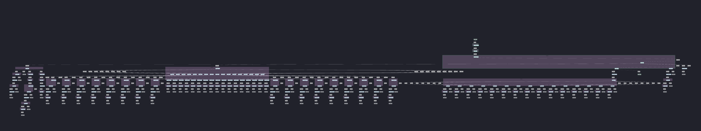
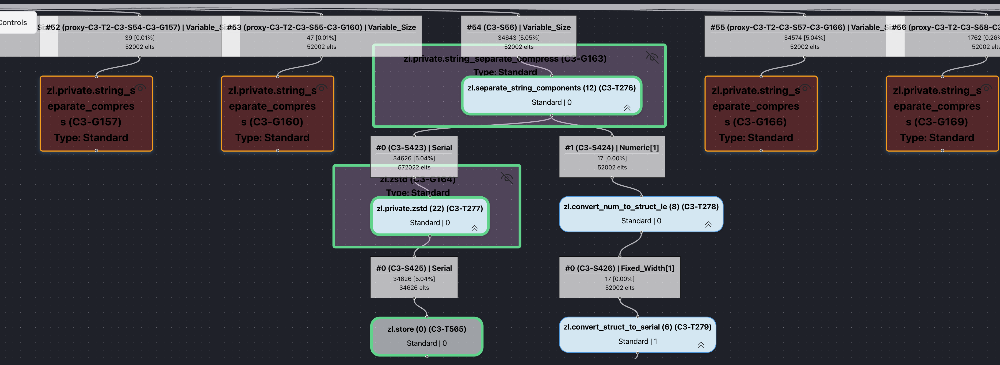
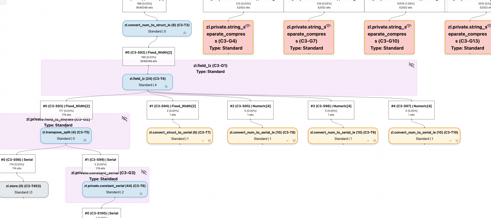

# Visualizing OpenZL Graphs

OpenZL’s graph model is key to its ability to outperform generic compressors. Understanding and optimizing OpenZL compression requires understanding the compression graph. As part of the team’s continued focus on the user experience, we’ve developed an [interactive visualization tool](/tools/trace) that makes this task simple.

## Background

When preparing for open-sourcing, it was clear that we needed a new visualization tool. The old visualization tool, named streamdump, had served us well but was quickly becoming insufficient. For instance, streamdump works at decompress time only, and was designed in such a way that corrupted frames could not be inspected.

To develop the new visualizer, we decided to build on top of OpenZL introspection, a recently developed checkpoint-based tracing framework also used by the OpenZL trainer to collect training samples. Introspection gives us the flexibility to offer richer functionality than streamdump.

## How it Works

The new visualizer works in a two-step process similar to Linux perf. The application that does the visualization is a static web app that ingests a “trace” object created by instrumenting a compression. There’s a new `--trace` option you can add to a `zli compress` call that generates this trace. In our perf analogy

|`perf record`|`zli compress --trace`|
| --------- | --------- |
|`perf report`|[openzl.org/tools/trace](/tools/trace)|

The visualizer link also has detailed instructions for recording traces and an API method for taking traces without using the CLI.

## Feature Showcase

Here are some nice features we’ve built so far.

### Dynamic Representation

The visualizer allows you to explore large graphs easily. By default, standard graphs are collapsed so you can focus on the parts of the graph that matter for you. In this example, the Field LZ graph is collapsed, hiding 100+ nodes of complexity.

### Performance Analysis

One of the most important features of streamdump was the ability to identify the largest contributors to compressed size. This is replicated in the visualizer, with an additional feature to highlight the “hottest” subgraph at each level.

### Function Graph Visualization

Function graphs are an important source of runtime dynamicity in OpenZL. The trace captures the specific codecs run as part of a function graph and the visualizer displays the relationship between graphs and codecs.

### Error Tracing

  

Debugging graphs is a critical part of developing a new compressor. If an error is encountered, the trace will capture this information and the visualizer will display the exact source of the error.

### Chunking Support

New features like chunking are not supported by streamdump. As the OpenZL featureset evolves, more features will be added that are easy to support using introspection but difficult using streamdump.

## What’s Next

Here are a few features we’re thinking about:

### Decompression

So far, tracing is only supported during compression. Bringing the analogous functionality to decompression time will allow us to deprecate streamdump once and for all.

### Selector visualization

Selectors are a powerful underutilized tool in OpenZL. Enhancing support for visualizing selector choices will help drive utilization.

### Performance Mode

Trained OpenZL compressors are often very large and have high fanout. This makes performance analysis more difficult. We can take some pointers from the UI of perf report to make navigation and analysis easier.

## A Special Shoutout

Creating an MVP for visualization was the topic of [Aryan Gandevia](https://github.com/aryan-gandevia)'s internship. Much of the UI design and visualization code is inherited from this MVP. Thanks for all your hard work!
