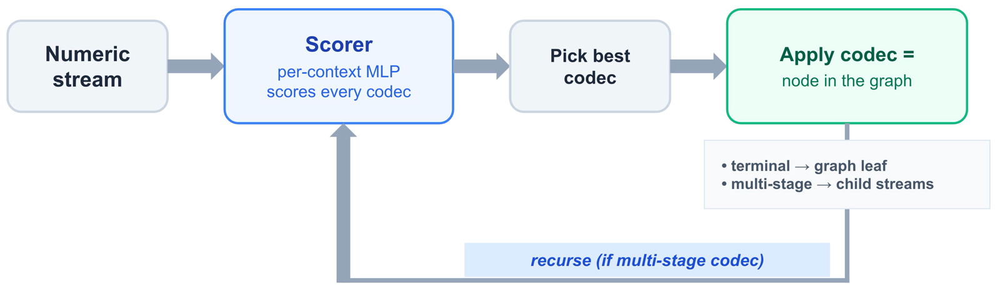
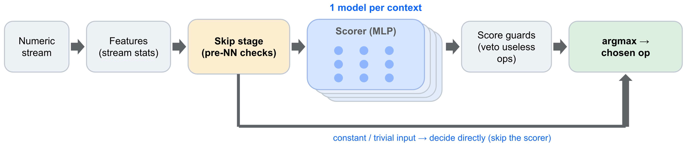

# The Compression Transformer

*Letting a neural network build the compression graph*

OpenZL compresses data by chaining processing layers in any order. This is powerful, but requires careful configuration: choosing the right combination of codecs for a given input has always been its greatest challenge. The Compression Transformer now makes that choice automatically, building the compression graph on the fly, one decision at a time. It needs no per-source training, no manual tuning, and no change on the decompression side. It is available from both the API and the CLI.

<!-- more -->

## The Power — and Complexity — of Graph Compression

OpenZL losslessly compresses data using a collection of codecs that can be [freely combined into graphs](https://engineering.fb.com/2025/10/06/developer-tools/openzl-open-source-format-aware-compression-framework/). A graph can push one input stream through several stages, split it into child streams, and choose a different codec for each one. This flexibility is powerful: in theory, searching the full space of possible graphs would find the best compression strategy for every input. In practice, that search is far too expensive to perform while data is being compressed, so production systems must settle for simpler strategies that are broadly effective.

One can tune a graph by hand, but it is time-consuming and does not scale well. That is why OpenZL comes with a trainer, `zli train`, which analyzes representative samples from a data source and generates a graph optimized for that traffic. [ACE](../../getting-started/using-openzl.md#ace-training) produces multiple graphs spanning different compression-ratio and speed trade-offs, letting the user choose which one best corresponds to their constraint.

This approach depends on two assumptions: that the samples represent future traffic, and that the traffic is reasonably homogeneous. Those assumptions often hold. When they do not, the trainer has to settle on a middle ground — a graph that works adequately across the different shapes in the sample, but is optimal for none of them.

The natural next step is to adapt the graph to each individual input, in real time. Choosing the graph per input could handle heterogeneous traffic, respond to outliers, and absorb unannounced changes in the data, all without manual intervention or source-specific training. This is the capability that the Compression Transformer brings to OpenZL.

## How the Compression Transformer Works

The Compression Transformer generates a compression graph from a data stream, one decision at a time. There is a useful analogy to a large language model generating text, hence the name: at each step, the model emits a token conditioned on its current context. In OpenZL, that token determines a codec and its set of parameters, that is, the next node in the graph. The produced output is not a linear sequence, however. Multi-stage codecs produce child streams, and the model generates decisions for each child, recursively building a graph.

For each new stream, a specialized scorer — a small multilayer perceptron (MLP), one per context (for now, one per numeric element width) — evaluates every candidate codec. The selector picks the highest-scoring valid codec and applies it. If that codec produces child streams, they are fed back into the selector. In this way, the compression graph assembles itself one node at a time.



A few design choices make this practical and robust:

- **Skip stage:** trivial inputs, such as empty or constant streams, are handled directly without invoking the neural network.
- **Score guards:** deterministic rules reject impossible or nonsensical operations after the scorer has ranked the candidates. They also drop codecs that are unavailable in the requested format version, so the produced graph is valid for target decompressors.
- **Depth guard and static fallback:** recursion is bounded, and low-confidence decisions fall back to a deterministic decision tree.
- **Standard integration:** the Transformer plugs into OpenZL as a regular selector. It needs no special execution framework.



The model only runs at compression time. The produced result is an ordinary OpenZL frame, read back by the same universal decompressor as usual.

In its first implementation, the Transformer is focused on numeric types, and ships four scorers, one per numeric element width (1, 2, 4 and 8 bytes).

## Results Overview

We have evaluated the numeric Transformer against 868 families of numeric streams, totalling 34,737 files and 17.9 GB, each family representing a different data shape. In the results presented below, the Transformer is compared against OpenZL, untrained and trained, and against the strongest settings of two widely used general-purpose compressors, [`zstd -19`](http://zstd.net) and `xz -9`. These are compression-ratio references, not speed ones: the Transformer compresses much faster than `zstd -19`, at speeds comparable to `zstd -8` to `-12` depending on data width.

Figures are weighted geometric means of compression ratios. "OpenZL untrained" is OpenZL’s default numeric path at the default compression level (6), which compresses with Field LZ; "OpenZL trained" uses a graph trained with [ACE](../../getting-started/using-openzl.md#ace-training) separately for each family.

<!-- Per-width rows: recomputed from the per-family rows of test_model.py, weight = sqrt(files)
     (test_model.py's per-context weighting); non-Transformer columns carry the ~0.5% rounding
     error noted below. `all` row: the `Overall` line of test_model.py. -->

| numeric width | zstd -19 |  xz -9 | OpenZL untrained | OpenZL trained | Transformer | vs zstd -19 |
|---------------|---------:|-------:|-----------------:|---------------:|------------:|------------:|
| `num8`        |   12.26x | 10.19x |           9.867x |         12.23x |      12.42x |       +1.3% |
| `num16`       |   6.772x | 6.467x |           6.515x |         8.415x |      8.429x |      +24.5% |
| `num32`       |   3.056x | 3.483x |           3.516x |         4.390x |      4.255x |      +39.2% |
| `num64`       |   4.578x | 5.586x |           6.114x |         8.723x |      8.477x |      +85.2% |
| **all**       |   5.752x | 5.920x |           6.036x |         7.846x |      7.760x |  **+34.9%** |

The Transformer lands within 1.1% of OpenZL trained overall, without needing any per-family training.

For details per data type, please consult the following tables:

<!-- Precision note: `zstd -19` and `untrained` ratios are derived from the integer-rounded
     percentages in test_model.py's output, so they carry up to ~0.5% error.
     Some family names are truncated at 41 chars by the benchmark tool. -->

??? note bench "num8 — best, median and worst of 151 families"

    
    

    | family                                 | zstd -19 | untrained | Transformer | vs zstd -19 |
    |----------------------------------------|---------:|----------:|------------:|------------:|
    | `seismic_waveform_u8`                  |   2.319x |    2.092x |      4.476x |       1.93x |
    | `cms__collection17._0.Photon_seedGain` |   142.7x |    130.9x |      252.6x |       1.77x |
    | `uci_dorothea_features_u8`             |   61.17x |    50.30x |      99.09x |       1.62x |
    | `statsbomb_event_second`               |   2.098x |    1.862x |      3.147x |       1.50x |
    | `isd_day`                              |   73.63x |    26.09x |      107.5x |       1.46x |
    | `h1_L4subtr._0`                        |   61.14x |    43.24x |      88.65x |       1.45x |
    | `sentinel2_scl_u8`                     |   762.8x |    459.2x |      945.9x |       1.24x |
    | *… median …*                           |          |           |             |             |
    | `fsdd_pcm_u8`                          |   2.021x |    1.948x |      2.162x |       1.07x |
    | `genomes_u8`                           |   4.006x |    3.492x |      4.086x |       1.02x |
    | `nicer_rawy_u8`                        |   2.782x |    2.402x |      2.810x |       1.01x |
    | `cms__collection22._0.Tau_idAntiEle`   |   4.020x |    3.099x |      4.060x |       1.01x |
    | `quickdraw_bitmap_u8`                  |   3.139x |    2.963x |      3.170x |       1.01x |
    | `census_pums_usual_hours_worked_u8`    |   2.248x |    1.972x |      2.248x |       1.00x |
    | `openf1_brake`                         |   43.23x |    34.73x |      42.37x |       0.98x |
    | *… worst …*                            |          |           |             |             |
    | `uci_mhealth_activity_state_u8`        |    1014x |    914.5x |      932.8x |       0.92x |
    | `cov_col_14`                           |   427.6x |    299.3x |      359.2x |       0.84x |
    | `bbbc038_nuclei_masks_u8`              |    1829x |     1309x |       1427x |       0.78x |
    | `openf1_drs`                           |   356.0x |    237.4x |      242.1x |       0.68x |
    | `cds_codon_start_u8`                   |   65.74x |    31.61x |      32.87x |       0.50x |

??? note bench "num16 — best, median and worst of 226 families"

    
    

    | family                                  | zstd -19 | untrained | Transformer | vs zstd -19 |
    |-----------------------------------------|---------:|----------:|------------:|------------:|
    | `zeroswarm_modbus_transaction_id_u16`   |   3.403x |     2982x |       7872x |       2313x |
    | `gtfs_arrival_minute`                   |   3.793x |    3.966x |      13.96x |       3.68x |
    | `zeroswarm_modbus_holding_register_u16` |   540.5x |    820.4x |       1854x |       3.43x |
    | `bidmc_respiration_adc_i16`             |   2.814x |    3.435x |      7.935x |       2.82x |
    | `vacv_core_segmentation_volume_u16`     |    3101x |     3632x |       6574x |       2.12x |
    | `air_day`                               |   55.61x |    36.45x |      109.0x |       1.96x |
    | `isd_day`                               |   121.2x |    51.02x |      200.0x |       1.65x |
    | *… median …*                            |          |           |             |             |
    | `chbmit_f8_t8_1d_var`                   |   1.614x |    1.816x |      2.179x |       1.35x |
    | `ghcn_tavg`                             |   1.844x |    1.888x |      2.360x |       1.28x |
    | `parking_facility_occupancy_i16`        |   1.380x |    1.537x |      1.767x |       1.28x |
    | `openalex_source_h_index_u16`           |   3.050x |    3.149x |      3.873x |       1.27x |
    | `msd_year`                              |   4.829x |    4.829x |      6.085x |       1.26x |
    | `wine_moderate`                         |   2.168x |    2.239x |      2.732x |       1.26x |
    | `bbbc021_microscopy_u16`                |   2.762x |    2.762x |      3.287x |       1.19x |
    | *… worst …*                             |          |           |             |             |
    | `bts_crs_arr_minute`                    |   5.070x |    5.180x |      4.766x |       0.94x |
    | `gtfs_service_id`                       |    2366x |     1410x |       2058x |       0.87x |
    | `nvd_cvss_metric_group_id`              |   35.69x |    28.36x |      30.34x |       0.85x |
    | `ghcn_wesd`                             |   6.598x |    4.846x |      5.476x |       0.83x |
    | `suitesparse_bcsstk27_gap`              |   176.5x |    101.9x |      144.7x |       0.82x |
    | `isd_precip1h`                          |   398.5x |    196.6x |      294.9x |       0.74x |
    | `ndbc_missingmask`                      |   8.575x |    3.691x |      5.574x |       0.65x |

??? note bench "num32 — best, median and worst of 249 families"

    
    

    | family                                      | zstd -19 | untrained | Transformer | vs zstd -19 |
    |---------------------------------------------|---------:|----------:|------------:|------------:|
    | `zeroswarm_tcp_sequence_u32`                |   3.940x |    230.2x |       9098x |       2309x |
    | `ncbi_nodes_tax_id_u32`                     |   3.894x |    73.24x |      131.1x |       33.7x |
    | `metmuseum_object_id_u32`                   |   3.760x |    29.46x |      44.78x |       11.9x |
    | `nist_matrix_market_col_index_u32`          |   21.67x |    58.25x |      156.7x |       7.23x |
    | `gtfs_arrival_seconds_i32`                  |   22.17x |    22.61x |      149.2x |       6.73x |
    | `geonames_altname_geoname_id_u32`           |   7.291x |    28.91x |      33.54x |       4.60x |
    | `gdc_ssm_position_u32`                      |   2.973x |    4.604x |      5.202x |       1.75x |
    | *… median …*                                |          |           |             |             |
    | `snap_roadnet_edges_i32`                    |   3.503x |    4.799x |      4.799x |       1.37x |
    | `statsbomb_event_location_x`                |   2.480x |    2.893x |      3.298x |       1.33x |
    | `inspirehep_citation_count_u32`             |   4.643x |    4.678x |      6.082x |       1.31x |
    | `wwpdb_measured_struc..tor_uncertainty_f32` |   2.152x |    2.311x |      2.819x |       1.31x |
    | `walking_forceplate_analog_f32`             |   2.616x |    2.957x |      3.401x |       1.30x |
    | `silso_sunspot_activity_indices_f32`        |   4.852x |    5.181x |      6.114x |       1.26x |
    | `openneuro_t1w_mri_f32`                     |   5.172x |    5.388x |      6.465x |       1.25x |
    | *… worst …*                                 |          |           |             |             |
    | `zenodo_marine_dom_intensity_f32`           |   1.115x |    1.226x |      1.226x |       1.10x |
    | `eht_visibility_real_f32`                   |   1.079x |    1.200x |      1.176x |       1.09x |
    | `gpt2_mlp_bias`                             |   1.069x |    1.155x |      1.155x |       1.08x |
    | `pfam_profile_hmm_match_emissions_f32`      |   1.384x |    1.496x |      1.481x |       1.07x |
    | `open_buildings_geometry_f32`               |   2.032x |    1.935x |      2.012x |       0.99x |
    | `dino_embed`                                |   2.421x |    2.096x |      2.348x |       0.97x |
    | `openimages_bbox_coords_f32`                |   1.889x |    2.087x |      1.795x |       0.95x |

??? note bench "num64 — best, median and worst of 242 families"

    
    

    | family                                      | zstd -19 | untrained | Transformer | vs zstd -19 |
    |---------------------------------------------|---------:|----------:|------------:|------------:|
    | `binance_kline_open_time_ms_u64`            |   2.973x |    450.3x |       6237x |       2098x |
    | `h1__collection2`                           |   8.807x |     3004x |      11567x |       1313x |
    | `cms__collection16`                         |   9.105x |     1019x |       3393x |        373x |
    | `photon_convType`                           |   7.994x |    516.7x |       1452x |        182x |
    | `cms__collection3`                          |   10.12x |    58.46x |      64.89x |       6.41x |
    | `dc_lidar_2015_gps_time_f64`                |   5.802x |    14.40x |      29.53x |       5.09x |
    | `noaa_coops_9447130_seattle`                |   4.050x |    3.920x |      14.62x |       3.61x |
    | *… median …*                                |          |           |             |             |
    | `gharchive_push_id`                         |   7.155x |    10.67x |      11.52x |       1.61x |
    | `globalcmt_moment_tensor_f64`               |   2.739x |    2.470x |      4.273x |       1.56x |
    | `nasa_power_solar_allsky_sw_down_f64`       |   2.444x |    1.330x |      3.763x |       1.54x |
    | `pglib_opf_branch_f64`                      |   5.925x |    5.364x |      9.066x |       1.53x |
    | `usgs_streamflow_cfs_f64`                   |   4.263x |    3.724x |      6.479x |       1.52x |
    | `ndbc_wave_spectral_density_f64`            |   8.122x |    8.590x |      11.94x |       1.47x |
    | `binance_spot_aggtrades_quantity_f64`       |   4.282x |    4.312x |      6.037x |       1.41x |
    | *… worst …*                                 |          |           |             |             |
    | `noaa_cors_carrier_phase_f64`               |   1.510x |    1.350x |      1.525x |       1.01x |
    | `jpl_cad_v_rel`                             |   1.064x |    1.182x |      1.064x |       1.00x |
    | `sec_fsd_shares_inves.._balance_shares_i64` |   2.465x |    1.883x |      2.391x |       0.97x |
    | `noaa_cors_pseudorange_f64`                 |   1.701x |    1.571x |      1.650x |       0.97x |
    | `msd_timbre_cov`                            |   1.452x |    1.183x |      1.408x |       0.97x |
    | `binance_usdm_kline_t..uy_quote_volume_f64` |   1.443x |    1.172x |      1.371x |       0.95x |
    | `nist_matrix_market_sparse_f64`             |   6.397x |    5.560x |      5.949x |       0.93x |

At the time of writing, the Transformer does well on a broad range of numeric data shapes, but its gains are uneven, and it still makes mistakes: it trails `zstd -19` on 95 of the 868 families, by up to 2x in the worst case. This is still early days, and we expect these gaps to shrink as the model improves.

## Trying It Out

The Transformer ships with OpenZL v0.3.0, and is currently opt-in. From the [CLI](../../getting-started/quick-start.md#building-the-openzl-cli), you can see the Transformer in action by requesting compression level 7 or above. It works for direct numeric streams, or for numeric child streams, for example extracted from a parsing operation (like [SDDL](../../sddl/index.md)).

```sh
./zli compress --profile le-i32 --level 7 examples/getting_started/sample_inputs/era5_ints.bin --output era5_ints.zl
```

On this sample, the compression ratio goes from 18.95x at the default level to 29.41x at level 7.

From the C API, select `ZL_GRAPH_TRANSFORMER_NUMERIC` as the starting graph, or `ZL_GRAPH_NUMERIC` with compression level 7 or above:

```c
#include "openzl/codecs/zl_transformer.h"

ZL_Report r = ZL_Compressor_selectStartingGraphID(
        compressor, ZL_GRAPH_TRANSFORMER_NUMERIC);
```

From C++, the same graph is available as `openzl::graphs::TransformerNumeric`:

```cpp
#include "openzl/cpp/codecs/Transformer.hpp"

compressor.selectStartingGraph(openzl::graphs::TransformerNumeric::graph);
```

It accepts one or more numeric streams of width 1, 2, 4 or 8 bytes.

If you want to see what the model decided, add `--trace era5_ints.cbor` to the command above and open that file in the [graph visualizer](/tools/trace/) — the Transformer’s choices show up as ordinary graph nodes, since that is what they are.

## What’s Next

Two directions are already clear.

First, we want to take the Transformer beyond numeric streams. Other stream types, such as `string`, will be covered in future expansions.

Second, we want to make speed an explicit target, so the selector can find the best compression ratio _within a stated performance budget_, instead of just aiming at the strongest option.

Those are subjects for a future post. The larger point is already here: a compression graph no longer has to be designed or trained ahead of time. It can be built on the fly, for each input, by a model that reads the data as it goes, so when the data changes, the graph changes with it. And since the result is an ordinary OpenZL frame, that model can keep getting smarter over time, without the decompressor having to change or be redeployed.
