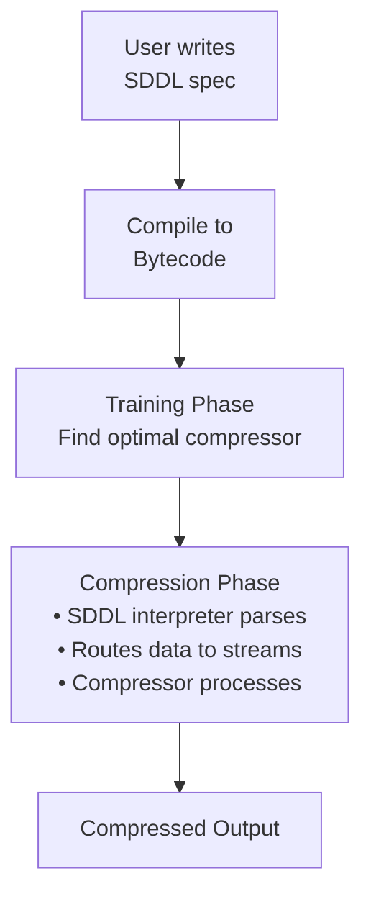

# Introduction & Motivation

*Chapter 1 - Understanding SDDL's purpose and benefits*

Binary data is everywhere. From databases to machine learning datasets, from network protocols to file formats, our digital world runs on structured binary data. Describing this data typically happens in two places: human-readable documentation (specifications, white papers, format descriptions) and executable code (parsers). SDDL provides a middle ground: a description that is both human-readable and directly usable by computers.

---

## What is SDDL?

**SDDL (Simple Data Description Language)** is a domain-specific language for describing binary file formats and data layouts. It provides a clear, human-readable way to specify how binary data is structured, without writing parsing code.

Think of SDDL as a "blueprint language" for binary data. The actual parsing is handled by an interpreter that reads your SDDL specification.

### A short example

Consider the SAO (Smithsonian Astronomical Observatory) star catalog format used in the Silesia compression benchmark. The simplest version looks like this:

```sddl
# Star catalog entry (28 bytes)
record StarEntry() {
  SRA0:  Float64LE,    # Right Ascension (radians)
  SDEC0: Float64LE,    # Declination (radians)
  ISP:   Bytes(2),     # Spectral type
  MAG:   Int16LE,      # Magnitude
  XRPM:  Float32LE,    # R.A. proper motion
  XDPM:  Float32LE     # Dec. proper motion
}

# File structure
header: Bytes(28)
stars: StarEntry[]
```

That's it. A few fields, clean and readable. Compare this to writing a parser with proper error handling, endianness management, and structure alignment—easily 200+ lines of code, with associated maintenance and security concerns.

> **💡 Language Reference:** For a complete overview of SDDL's primitive types, records, and language constructs, see [Language Elements Overview](core-concepts.md#language-elements-overview).

---

## The Problem: Manual Parser Development

### The Documentation-to-Code Gap

Binary formats are typically documented in two separate forms:

1. **Human-readable documentation:** PDF specifications, RFC documents, white papers describing field layouts ("The header contains a 4-byte magic number, followed by a 32-bit little-endian size field...")

2. **Executable code:** C/C++ parsers implementing the specification with buffer operations, pointer arithmetic, and error handling

These two representations don't connect directly. Translating from documentation to code is manual work. When the format changes, both need updating, often by different people, which can lead to inconsistencies.

SDDL provides a format description that is both readable and executable - serving as documentation that can be directly consumed by tools.

### Two Approaches Before SDDL

If you wanted to process binary data with OpenZL (or any compression tool), you had two options:

### Option 1: Write Custom Parsing Code

Writing a parser manually involves considerable boilerplate code. Getting byte offsets correct requires careful attention, and mistakes can be difficult to debug. When the format changes, multiple parts of the code need updating to stay consistent. The resulting code doesn't clearly communicate the format structure to someone reading it later. The entire process—writing, compiling, testing, and debugging—takes time that could be spent on other tasks.

### Option 2: Use Generic Parsers

Use existing schema languages (Protocol Buffers, Avro, etc.) that were designed for different purposes—typically for defining new formats rather than describing existing ones.

These tools work in the opposite direction: they let you define a new format and generate code to serialize/deserialize it. But if you already have data in an existing format, you need to describe it as it is, not define how it should be. These schema languages also tend to include many features beyond simple format description, adding complexity. They focus on generating parsing code rather than describing data layout, and they don't provide visibility into performance characteristics like instant-parse.

---

## The SDDL Proposition

SDDL provides a simple, readable way to describe binary data formats that can be consumed by downstream processes like compression. The language is explicit about endianness and performance characteristics, learnable quickly, and simple enough for AI assistants to generate specifications from documentation.

---

## SDDL in the OpenZL Workflow

SDDL was designed with OpenZL compression in mind, though it's a standalone specification that could be used for other purposes.

### The Compression Workflow



### How SDDL Helps OpenZL

SDDL tells OpenZL about your data's structure. OpenZL can then route different fields to separate streams, since different data types compress differently. It can apply specialized codecs—floats, integers, and strings each benefit from different compression techniques. Array-of-structures layouts can be transformed into structure-of-arrays when beneficial. When a format is instant-parse, OpenZL can parse the data very quickly.

These capabilities allow OpenZL to achieve compression ratios and speeds that significantly outperform general-purpose compressors.

---

## The Instant-Parse Model

SDDL's most distinctive feature is the **instant-parse model**—the ability to determine at compile-time whether a format can be parsed with zero sequential dependencies. An instant-parse format is one where all field offsets, sizes, and layout can be computed from parameters and constants alone, without examining the data.

**Instant-Parse Example:**
```sddl
record Header(size) {
  magic: Bytes(4),
  data: Bytes(size)   # size is a parameter - known upfront
}
```

**Requires-Scan Example:**
```sddl
record Header() {
  magic: Bytes(4),
  size: Int32LE,
  data: Bytes(size)   # size depends on parsed field - must scan
}
```

When a format is instant-parse, parsing becomes much faster (often 10x or more), zero-copy techniques become possible, and multiple threads can work independently. The `@instant_parse` annotation makes this explicit and enforceable—the compiler will report an error if you accidentally add a scan dependency. For the SAO example, instant-parse enables negligible parsing overhead and multi-GB/s compression speeds.

*For detailed information about all primitive types and their instant-parse characteristics, see the [Language Elements Overview](core-concepts.md#language-elements-overview).*

---

## A More Complex Example

Here's the full SAO format specification, showing SDDL's expressiveness:

```sddl
record CatalogHeader() {
  STAR0: Int32LE,   # Subtract from star number to get sequence number
  STAR1: Int32LE,   # First star number in file
  STARN: Int32LE,   # Number of stars; <0 → coordinates J2000
  STNUM: Int32LE,   # ID scheme / name flag
  MPROP: Int32LE,   # Motion info: 0=none, 1=proper, 2=radial
  NMAG:  Int32LE,   # Number of magnitudes (0–10)
  NBENT: Int32LE    # Bytes per star entry
}

record StarEntry(STNUM, MPROP, NMAG) {
  when STNUM >= 0 { XNO: Float32LE },     # Catalog number

  SRA0:  Float64LE,                        # Right Ascension
  SDEC0: Float64LE,                        # Declination
  ISP:   Bytes(2),                         # Spectral type

  when abs(NMAG) > 0 { MAG: Int16LE[abs(NMAG)] },  # Magnitudes

  when MPROP >= 1 {
    XRPM: Float32LE,                       # R.A. proper motion
    XDPM: Float32LE                        # Dec. proper motion
  }
  when MPROP == 2 { SVEL: Float64LE },    # Radial velocity

  when STNUM < 0 { NAME: Bytes(-STNUM) }  # Object name
}

# File structure
header: CatalogHeader

var STNUM = header.STNUM
var MPROP = header.MPROP
var NMAG  = header.NMAG
var NBENT = header.NBENT
var record_count = abs(header.STARN)

expect sizeof(StarEntry(STNUM, MPROP, NMAG)) == NBENT

stars: StarEntry(STNUM, MPROP, NMAG)[record_count]
```

This describes the **entire SAO catalog format family**—handling different versions, optional fields, and validation—in under 40 lines.

> **Understanding the Building Blocks:** This example uses records, parameters, variables, conditional fields, and arrays. For a systematic overview of these language elements, see [Language Elements Overview](core-concepts.md#language-elements-overview).

---

## Comparison with Alternatives

### vs Manual C/C++ Parsing

| Aspect | Manual Parser | SDDL |
|--------|--------------|------|
| **Lines of code** | 200+ | 10-50 |
| **Development time** | Hours to days | Minutes |
| **Requires compiler** | Yes | No |
| **Self-documenting** | No | Yes |
| **LLM-friendly** | Challenging | Easy |
| **Performance visibility** | Hidden | Explicit |

### vs Kaitai Struct

**Kaitai Struct** is the closest alternative—a declarative language for binary formats that generates parsers in multiple programming languages.

To understand the practical differences, let's compare how each language describes the simple SAO format:

**SDDL (10 lines):**
```sddl
record StarEntry() {
  SRA0:  Float64LE,
  SDEC0: Float64LE,
  ISP:   Bytes(2),
  MAG:   Int16LE,
  XRPM:  Float32LE,
  XDPM:  Float32LE
}

header: Bytes(28)
stars: StarEntry[]
```

**Kaitai Struct (approximately 30+ lines in YAML):**
```yaml
meta:
  id: sao
  endian: le

seq:
  - id: header
    size: 28
  - id: stars
    type: star_entry
    repeat: eos

types:
  star_entry:
    seq:
      - id: sra0
        type: f8
      - id: sdec0
        type: f8
      - id: isp
        size: 2
      - id: mag
        type: s2
      - id: xrpm
        type: f4
      - id: xdpm
        type: f4
```

**Why SDDL Instead of Kaitai?**

Kaitai Struct is a mature, well-designed language with a large ecosystem. So why create SDDL? The differences in the examples above point to specific design goals:

1. **Conciseness:** SDDL aims for minimal syntax overhead. The format description should read almost like the data structure itself. YAML's metadata sections and type separation add structure that's valuable for code generation but verbose for simple description.

2. **Explicit endianness:** In binary format work, endianness bugs are common and painful. SDDL requires every multi-byte type to declare its endianness (`Float64LE`, `Int32BE`), making it impossible to forget. This is visible at every field rather than being a global setting that must be remembered.

3. **Performance as a first-class concern:** The instant-parse concept needed to be built into the language from the start, not added later. SDDL's type system tracks layout determinism, and the `@instant_parse` annotation enforces it at compile time. This was critical for OpenZL's compression performance requirements.

4. **Self-contained descriptions:** SDDL specifications don't require metadata headers or configuration. The format description stands on its own, making it easier to read, share, and understand in isolation.

5. **Integration model:** Rather than generating parsers in multiple languages, SDDL generates bytecode for a specialized runtime optimized for data streaming and compression workflows. This allows tight integration with OpenZL without requiring code generation and compilation.

These aren't criticisms of Kaitai Struct—they reflect different design priorities. Kaitai was built for cross-platform parser generation and format exploration. SDDL was built for conciseness, performance visibility, and compression integration.

**Looking Forward:**

The languages serve different purposes and don't directly compete. Kaitai has a large installed base and ecosystem that SDDL doesn't attempt to replace. SDDL addresses specific needs within the OpenZL compression workflow.

Future interoperability is possible. One could imagine a Kaitai compiler targeting SDDL bytecode, or tools that translate between the formats. The choice of description language and the choice of runtime engine don't have to be tightly coupled.

### vs Protocol Buffers / Avro / FlatBuffers

These are **schema definition languages**—they define the format of new data you're creating.

**SDDL is different:** SDDL describes existing formats while schemas define new ones. SDDL lets you specify exact byte layout, whereas schemas make layout decisions for you. The fundamental use case differs—SDDL is for when you already have data and need to describe it.

---

## When to Use SDDL

SDDL is intended for data engineers who know their data formats and want to leverage that knowledge for better compression performance, without writing parsing code. You don't need to understand compression algorithms or OpenZL internals—just your data format.

SDDL works well when you have existing binary data and need to describe its structure for OpenZL compression. Most common file formats fall within SDDL's capabilities—those with simple to moderate complexity. The instant-parse model provides performance visibility and control. The language is also well-suited for rapid prototyping and LLM-assisted development.

SDDL may not be the best fit for extremely complex formats with heavy state machines or context-dependent parsing logic. If you need parsers in multiple programming languages, other tools are more appropriate. Formats requiring custom logic, complex validation, or computations may need dedicated parsers. For example, at Meta we use a dedicated parser for Thrift data due to its complexity and special requirements.

---

## Quick Wins

### 1. Instant Results with LLMs

Give an LLM the SDDL specification (see the [SDDL for LLMs reference](sddl-for-llm.md)) and ask:

> "Write an SDDL specification for the WAV audio format"

It will produce a working spec, often on the first try. No debugging C++ code.

### 2. Self-Documenting Formats

Your SDDL spec **is** your format documentation. It's clear, unambiguous, and actually executable.

---

## Current Status

**SDDL is in active development**. The v0.6 specification is feature-complete for most common formats, with core features now stable. The project is expected to be production-ready within the next few months. SDDL can already describe complex formats like TIFF, GGUF, EXR, PLY, and multi-channel WAV.

As the feature set matures, we expect rapid growth in adoption—particularly as users discover how much simpler SDDL makes working with binary data.

---

## Next Steps

Ready to get started?

- **[Getting Started](getting-started.md):** Install SDDL and write your first spec
- **[Core Concepts](core-concepts.md):** Learn the fundamental building blocks, including the comprehensive [Language Elements Overview](core-concepts.md#language-elements-overview)
- **[Understanding Instant-Parse](instant-parse.md):** Deep dive into SDDL's key feature

Or jump to the **[Language Reference](reference.md)** if you want the complete specification.

---

## Summary

SDDL is a **Simple Data Description Language** for describing binary data formats:

- **Simple:** Focused language with clear semantics
- **Explicit:** No hidden defaults, explicit endianness
- **Performance-aware:** Instant-parse status is visible and enforceable
- **Self-documenting:** Format descriptions are readable
- **LLM-friendly:** Suitable for code generation
- **Practical:** Addresses common use cases in compression workflows
